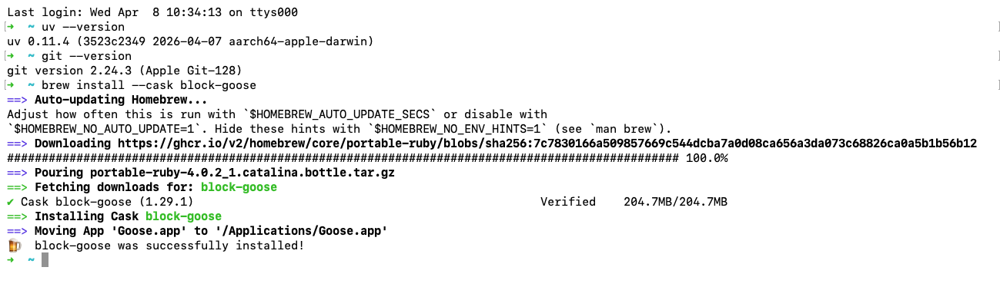
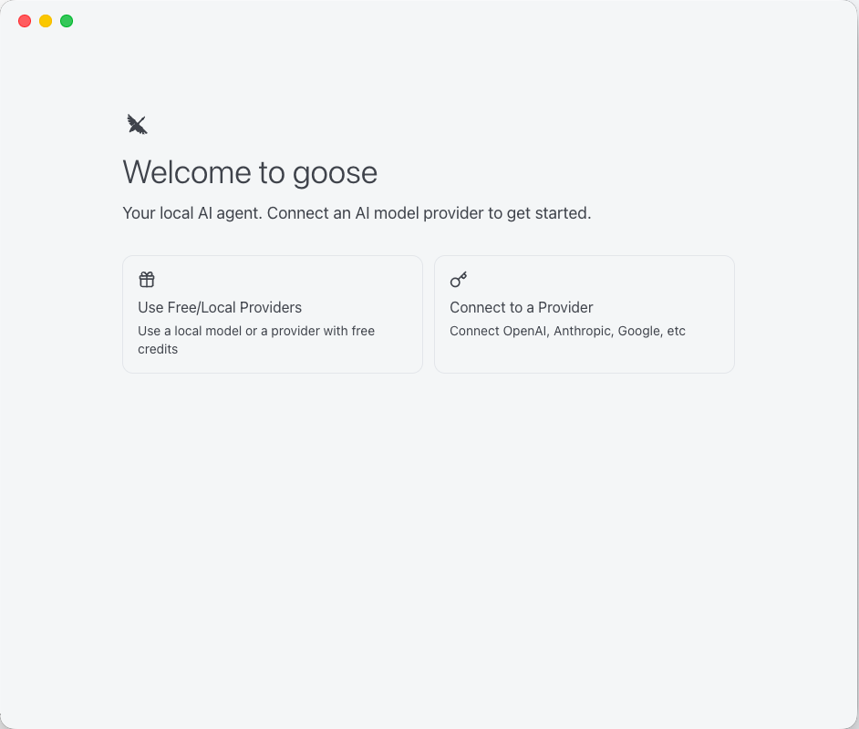
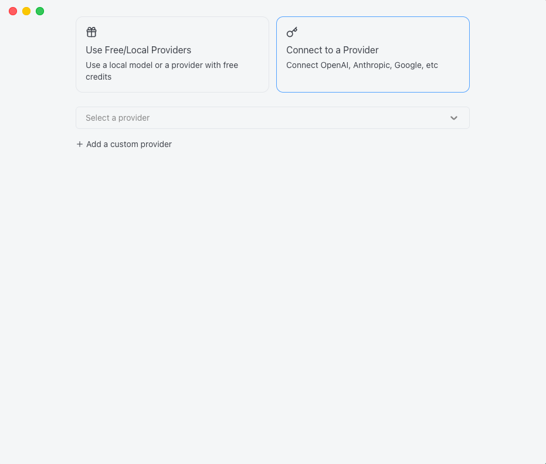
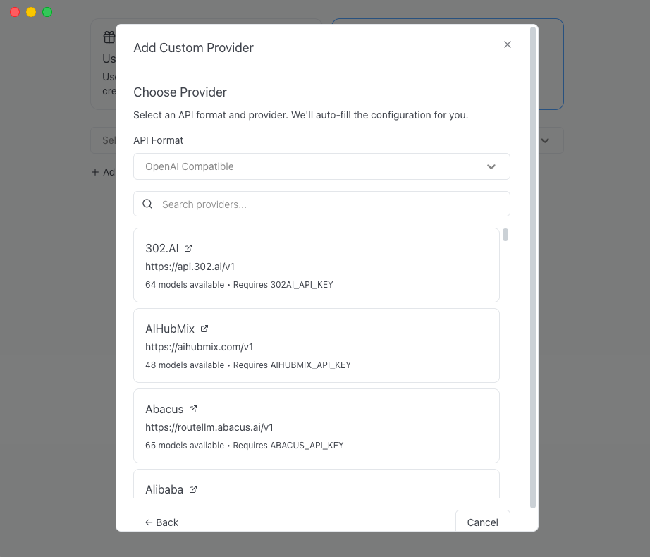
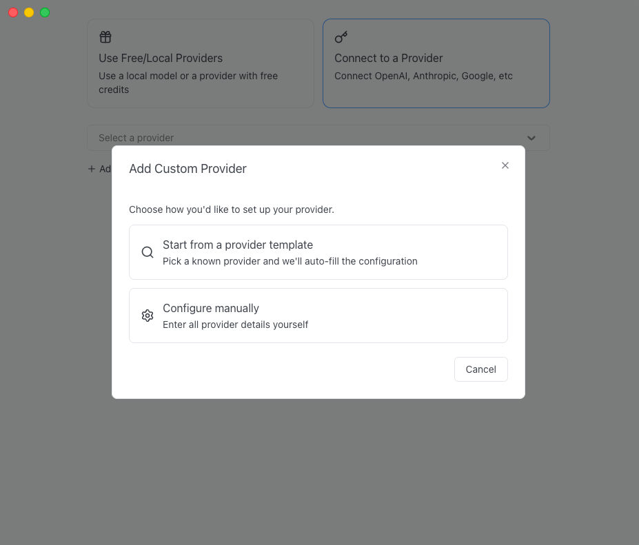

# Goose Desktop Setup For ESS-DIVE MCP

This guide is the detailed Goose Desktop version of the Quick Start in the main [README](../README.md).

Use this page if you want a step-by-step walkthrough for:

- installing `uv`
- installing Goose Desktop
- connecting Goose to an LLM provider
- adding `essdive-mcp` as a Goose extension

The screenshots in this guide were captured on macOS on April 8, 2026. The Goose layout is the same in principle on Windows and Linux, but the interface may look slightly different.

## What You Need Before You Start

You need all of the following:

- Python `3.10` or newer
- `uv`
- Goose Desktop
- an ESS-DIVE API token
- access to an LLM API that Goose can use

Important:

- Goose must be configured with a working model provider before the ESS-DIVE MCP extension will be useful.
- The ESS-DIVE token environment variable name must be exactly `ESSDIVE_API_TOKEN`.
- ESS-DIVE API tokens expire after 24 hours.

If you plan to use Berkeley Lab CBORG as your LLM provider, see [CBORG_SETUP.md](./CBORG_SETUP.md).

## 1. Install `uv`

Check whether `uv` is already installed:

```bash
uv --version
```

If that command fails, install `uv` using the official Astral instructions:

- macOS or Linux:

```bash
curl -LsSf https://astral.sh/uv/install.sh | sh
```

- Windows PowerShell:

```powershell
powershell -ExecutionPolicy ByPass -c "irm https://astral.sh/uv/install.ps1 | iex"
```

If the installer finishes successfully but `uv --version` still fails, restart your terminal or sign out and back in so your `PATH` refreshes.


## 2. Install Goose Desktop

The simplest cross-platform option is to download Goose Desktop from the official installation page:

- macOS, Linux, and Windows download links: <https://goose-docs.ai/docs/getting-started/installation/>

On macOS, you can also install Goose Desktop with Homebrew:

```bash
brew install --cask block-goose
```



After installation, launch Goose Desktop once so it can walk you through provider setup.

## 3. Configure Your LLM Provider In Goose

On first launch, Goose asks you to connect a model provider. That step is required before adding the ESS-DIVE MCP extension.

On the welcome screen, choose `Connect to a Provider`.





From there, you have two common paths:

### Use a built-in provider template

Choose a provider that Goose already knows how to configure, such as OpenAI or Anthropic, then enter the API key Goose asks for.



This is the easiest option if you already have a standard provider account.

### Add a custom provider

If your provider is OpenAI-compatible but not listed directly, choose `Add a custom provider`.



This is often the right path for:

- CBORG
- OpenRouter
- self-hosted OpenAI-compatible gateways
- other vendor-specific compatible endpoints

If you use CBORG, configure it first using [CBORG_SETUP.md](./CBORG_SETUP.md), then enter those settings in Goose.

Goose's current provider documentation is here:

- Configure providers: <https://goose-docs.ai/docs/getting-started/providers/>

After the provider is configured, start a normal Goose chat and confirm that Goose can answer a simple non-ESS-DIVE question. If it cannot, fix the provider setup before moving on.

## 4. Add ESS-DIVE MCP As A Goose Extension

Once Goose has a working model provider, add `essdive-mcp` as a custom extension.

Goose's extension UI is documented here:

- Using extensions: <https://goose-docs.ai/docs/getting-started/using-extensions/>

In Goose Desktop:

1. Open the sidebar.
2. Click `Extensions`.
3. Click `Add custom extension`.
4. Choose a command-line or `Standard IO` extension if Goose asks for a type.
5. Enter the ESS-DIVE MCP command.
6. Add the `ESSDIVE_API_TOKEN` environment variable.
7. Save the extension.

### Recommended extension values

If Goose asks for an extension ID, use `essdive-mcp`.

If Goose asks for a display name, use `ESS-DIVE MCP` or `essdive-mcp`.

If Goose asks for a description, you can use:

```text
Query ESS-DIVE datasets and ESS-DeepDive metadata from Goose.
```

Set the timeout to:

```text
300
```

### Command To Use

For the simplest Windows setup, use:

```text
uvx.exe --from git+https://github.com/ess-dive/essdive-mcp essdive-mcp
```

For macOS or Linux, use:

```text
uvx --from git+https://github.com/ess-dive/essdive-mcp essdive-mcp
```

If Goose asks for command and arguments separately, use:

- Windows command: `uvx.exe`
- Windows arguments: `--from git+https://github.com/ess-dive/essdive-mcp essdive-mcp`
- macOS/Linux command: `uvx`
- macOS/Linux arguments: `--from git+https://github.com/ess-dive/essdive-mcp essdive-mcp`

### Environment Variable To Add

Add this environment variable to the extension:

```text
ESSDIVE_API_TOKEN=YOUR_ESS_DIVE_TOKEN_HERE
```

This lets Goose pass your ESS-DIVE token to the MCP server without needing a separate local token file.

### Local Checkout Alternative

If you already cloned this repository and want Goose to run your local copy of the ESS-DIVE MCP instead of downloading from GitHub each time, you can use:

```text
uv run essdive-mcp --token-file /absolute/path/to/essdivetoken
```

That option is better for development or testing local changes. For most users, `uvx` is simpler.

## 5. Verify That The Extension Works

Open a new Goose chat and try one of these prompts:

```text
Find 3 public ESS-DIVE datasets about wildfire recovery and summarize each one in 1 sentence.
```

```text
Convert DOI 10.15485/2588618 to an ESS-DIVE dataset ID.
```

```text
Search ESS-DeepDive for temperature-related fields and summarize what datasets they come from.
```

Successful responses usually include one or more of the following:

- ESS-DIVE dataset titles
- ESS-DIVE dataset IDs
- DOI links
- summarized metadata
- grouped ESS-DeepDive field results

The exact content will change over time as ESS-DIVE and ESS-DeepDive are updated.

## Troubleshooting

### Goose answers normally, but never seems to use ESS-DIVE tools

Check all of the following:

- the extension is enabled in Goose
- the extension command is exactly correct
- the active model supports tool use
- the provider configuration itself works

### `uvx` or `uvx.exe` is not found

`uv` is installed, but Goose may not see it on your current `PATH` yet. Restart Goose Desktop after installing `uv`. If that still fails, restart your machine or reinstall `uv`.

### Authentication errors from ESS-DIVE

Goose may return a message like "It seems that I'm currently unable to access public datasets from the ESS-DIVE API due to authorization issues.".

Usually this means:

- the token was pasted incorrectly
- the environment variable name is not exactly `ESSDIVE_API_TOKEN`
- the token expired and needs to be regenerated

### You changed the extension, but Goose still behaves like the old version

Disable and re-enable the extension, or restart Goose Desktop so it launches a fresh MCP process.

## Related Docs

- Main setup overview: [README.md](../README.md)
- CBORG provider setup: [CBORG_SETUP.md](./CBORG_SETUP.md)
- Goose install docs: <https://goose-docs.ai/docs/getting-started/installation/>
- Goose provider docs: <https://goose-docs.ai/docs/getting-started/providers/>
- Goose extension docs: <https://goose-docs.ai/docs/getting-started/using-extensions/>
